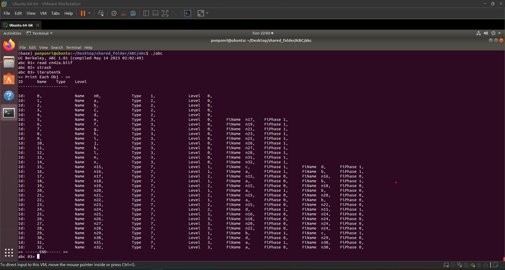
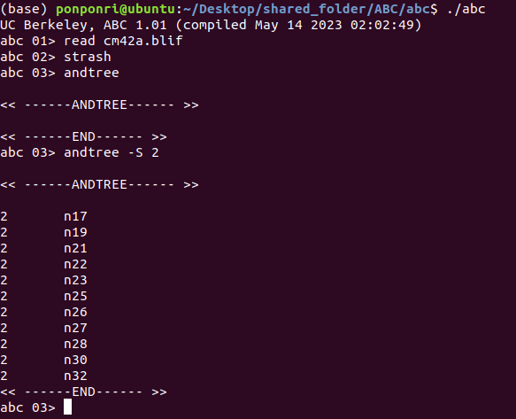
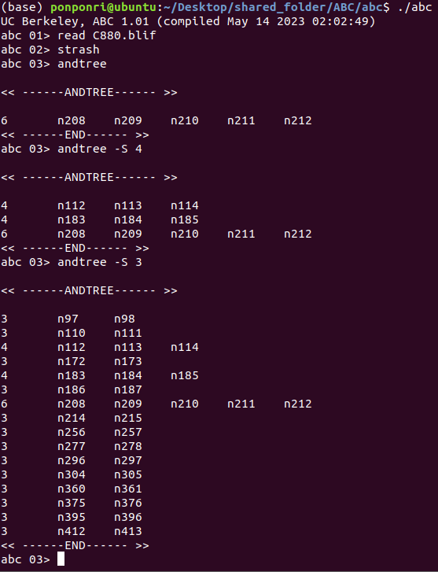

# Logic Synthesis and Verification HW1

# Programming ABC
## Add file
- src/testC/module.make
- src/testC/testcmd.c
- src/testC/testC.c
- src/testC/testC.h

## Change Code
- Makefile
- src/base/main/mainInit.c

# Environment
- Ubuntu 
- gcc (Ubuntu 7.5.0-3ubuntu1~18.04) 7.5.0
- g++ (Ubuntu 7.5.0-3ubuntu1~18.04) 7.5.0

# Compile project
```
cd abc
make
```

# Results
## Part 1
```
cd abc
./abc
read filename.blif 
strash
iteratentk
```
example:



## Part 2
```
cd abc
./abc
read filename.blif
strash
andtree [-S num]  # Print leaveNum that num>=5 as default
```
example1:



example2:




